## En qué ando

- Puliendo **KeyForge**, que ya va por más de 19 integraciones
- Metiendo capturas y documentación decente a todos mis repos
- Diseñando kits visuales para streamers: logos mascota, overlays e intros

## Proyectos

<table>
<tr>
<td width="50%" valign="top">

### KeyForge

Tu móvil convertido en mando del PC. Creas botones que abren programas, lanzan atajos y controlan OBS, Spotify o las luces. Escaneas un QR y ya está funcionando.

`Más de 19 integraciones` · `Emparejamiento por QR`

**[Ver el repositorio](https://github.com/Maitini/keyforge)**

</td>
<td width="50%" valign="top">

### Centinela-WP

Plugin de seguridad todo en uno para WordPress. Antivirus con seis modos de escaneo, cortafuegos, verificación en dos pasos, límite de intentos de acceso y copias de seguridad.

`PHP` · `WordPress`

**[Ver el repositorio](https://github.com/Maitini/Centinela-WP)**

</td>
</tr>
<tr>
<td width="50%" valign="top">

### ServerGuard

Anticheat para Minecraft 1.21.1. Detección de movimiento irregular y validación en el servidor.

`Java`

**[Ver el repositorio](https://github.com/Maitini/ServerGuard)**

</td>
<td width="50%" valign="top">

### custommobs

Sistema de mobs personalizados para Minecraft 1.21.1.

`Java`

**[Ver el repositorio](https://github.com/Maitini/custommobs)**

</td>
</tr>
</table>

## Con qué trabajo

**Código**

**Diseño**

## Mis commits, devorados

## Actividad

  

  

## Hablamos

Construyo herramientas para gente que las necesita y las diseño yo mismo. Si tienes un proyecto entre manos, un canal que necesita identidad visual o simplemente quieres cambiar ideas, escríbeme.

**[LinkedIn](https://www.linkedin.com/in/maitini1812/)** · **[Instagram](https://www.instagram.com/maitini1812/)**

